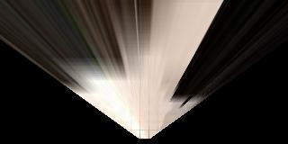

## Notebook analysis

The notebook provides a pre-recoded video of the rover exploring the environment with the intended purpose to apply
on it the main steps of the project.

The following steps are applied to each image of the video in order:
* Perspective transformation. Using open we warp the image as to have it look as if it is viewed from above the rover looking down. 



* A color threashhold is applied to the image. In order to map the area where it is safe for the rover to travel a way 
to distinguish rocks from other surfaces is necessary. This is done using a color threshold as the area where it is safe 
to travel is much lighter than the rocks that are surrounding it. 
A threshold of (160, 160, 160) is used producing the following binary image.


* Convert to rover-centric coordinates. The image that is produced by the above manipulations is not centered at the origin
so we need to remove this offset and rotate it so it is centered at the origin and the forward direction is along the x axis.

* Convert rover-centric pixel values to world coordinates. Since the position of the rover is known in the world so 
the points that were received from the previous step can be plotted on the map. We convert the pixels from rover centric 
to world coordinates. First the pixels are rotated using the yaw of the rover as the angle and then they are translated to
the position of the rover. They are also scaled since the map represents much larger area then currently visible. 

* Next the world map is updated with the pixels from the previous step.


## Autonomous Navigation and Mapping

A simulator from udacity is provided to test the navigation and mapping of an autonomous rover. The perception steps is 
done in the perception_step() method and follows what was described in the notebook section with the addition that rocks 
are also detected and mapped. Since the rocks are mostly yellow in color a threshold of (200,200,0) is used to detect them.
```python
rock_img = color_thresh(transformed_img, (200, 200, 0))
x_rock, y_rock = rover_coords(rock_img)
x_rock_world, y_rock_world = pix_to_world(x_rock, y_rock, Rover.pos[0], Rover.pos[1], Rover.yaw, 200, 10)
Rover.worldmap[y_rock_world, x_rock_world, 1] += 1
```
During the perception step after image is converted in rover coordinates they are also converted to polar coordinates 
so they can be used for the navigation.


During navigation a simple decision tree approach is used to send commands to the rover.
The current state is saved in Rover.mode and is updated on each step based on the perception data received in the 
Rover.nav_angles.

If the current mode is "forward" we make sure that we have enough space to move forward by counting the number of nav_angles 
values and if we do then we calculate the steering angle based on the mean of the nav_angles values. 
If there aren't enough nav_angle values we switch to "stop" mode and set the throttle to zero and increase the breaks value.

If we are "stop" mode then we check the perception data information to see if we have enough space. If not then we start 
turning the rover. If there is enough space then we increase the throttle and switch to "forward" mode. 

The way we check if there is enough space is by counting the number of nav_angles and thresholding them using the 
Rover.stop_forward value.


